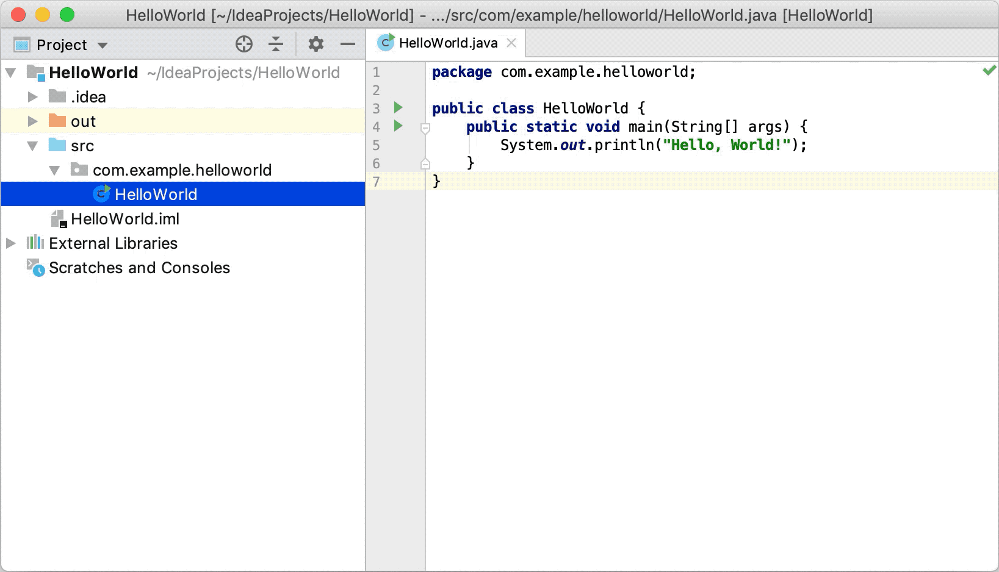
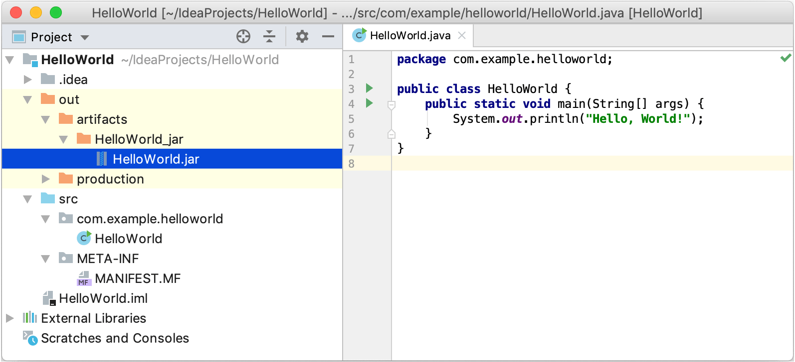

# Package an application into a JAR

For more info on where this is taken from : [JetBrains Website](https://www.jetbrains.com/help/idea/compiling-applications.html#package_into_jar)

When the code is compiled and ready, you can package your application in a Java archive (JAR) to share it with other developers. A built Java archive is called an artifact.

## Create an artifact configuration for the JAR

From the main menu, select File | Project Structure Ctrl+Alt+Shift+S and click Artifacts.

Click the Add button, point to JAR, and select From modules with dependencies.

To the right of the Main Class field, click the Browse button and select the main class in the dialog that opens (for example, HelloWorld (com.example.helloworld)).

IntelliJ IDEA creates the artifact configuration and shows its settings in the right-hand part of the Project Structure dialog.

Apply the changes and close the dialog.

## Build the JAR artifact

From the main menu, select Build | Build Artifacts | Build.

If you now look at the out/artifacts folder, you'll find your .jar file there.

