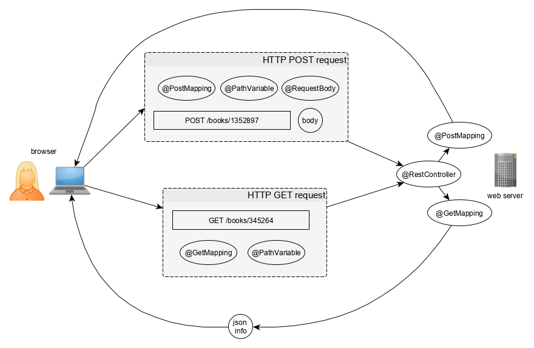

## Frameworks vs libraries
Applications that use frameworks are built on top of them and extend their code to get specific functionality. In a sense, a framework serves as the skeleton of an application or its parts and sets "the rules of the game". A library, on the other hand, only provides some specific operations without having such a global influence. This is the key difference between frameworks and libraries. However, libraries can be provided as parts of frameworks.

## Inversion of Control :
In a framework, unlike in libraries or standard user applications, the overall program's flow of control is dictated not by the caller, but by the framework. It means the framework calls your code, and not vice versa.

This happens because a framework provides templates for solving possible tasks and the interaction between the templates has been defined by developers of the framework. The user of a framework just takes the templates and extends them with application-specific code.

## @SpringBootApplication :

@RestController : 
```java 
//RestController itself is a wrapper to the below code.
@RestController
public class TaskController{}
 
 //Both the above and below code achive the same things.

@Controller
@ResponseBody
public class TaskController{}
```
Image describes @RestController and its operations : 



