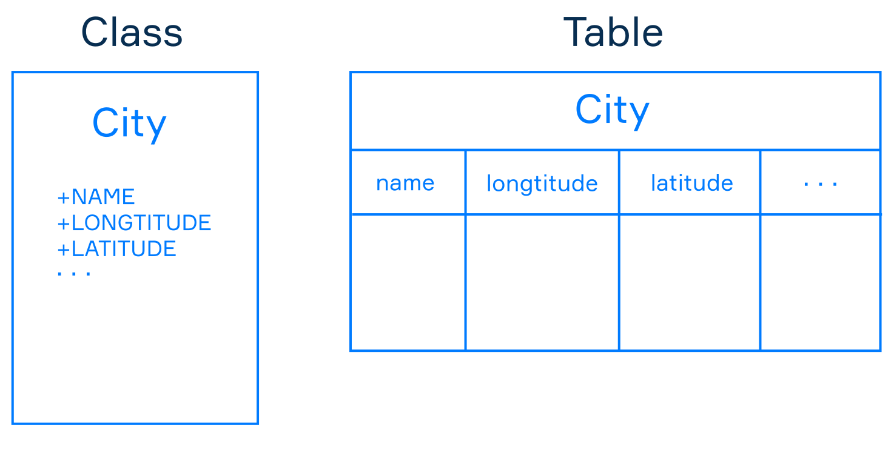
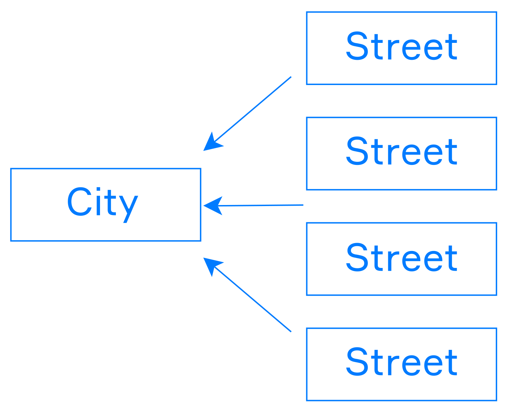
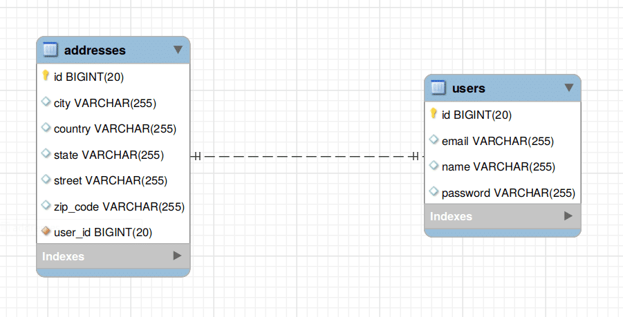

# Jackson annotations

> Serialization : Convert a object to JSON String
> Desrialization : Convert a json string into CustomObject

1. `@JsonAnyGetter` : The @JsonAnyGetter annotation allows the flexibility of using a Map field as standard properties.

```java
//The Object definition :
public class ExtendableBean {
    public String name;
    private Map<String, String> properties;
 
    @JsonAnyGetter
    public Map<String, String> getProperties() {
        return properties;
    }
}
```

```json
{
    "name":"My bean",
    "attr2":"val2",
    "attr1":"val1"
}
```

2. `@JsonPropertyOrder` : Orders the json as specified.

```java
@JsonPropertyOrder({ "name", "id" })
public class MyBean {
    public int id;
    public String name;
}
```

 `@JsonPropertyOrder(alphabetic=true)` could also be used.

 3. For more : https://www.baeldung.com/jackson-annotations

 4.  `@JsonFormat(shape = JsonFormat.Shape.STRING)` OR `@JsonFormat(shape = JsonFormat.Shape.STRING, pattern= "yyyy-MM-dd")`

 5. `@JsonProperty("date")` : Specify custom name for the property.

```java

@JsonProperty("date")
@JsonFormat(shape = JsonFormat.Shape.STRING, pattern="yyyy-MM-dd")
private Calendar someDate;
```

```json
{
  "fieldOne": "Some text",
  "date": "2019-02-26"
}
```

7. @JsonProperty(access = JsonProperty.Access.WRITE_ONLY)

8. Or the above acan be achieved by @JsonIgnore

```java
class User {

    // More fields here
    @JsonIgnore
    private String password;

    @JsonIgnore
    public String getPassword() {
        return password;
    }

    @JsonProperty
    public void setPassword(final String password) {
        this.password = password;
    }
}
```

6. Restricting seralizing and deseralizing : (Does not work : The getter and setters are important for some reason to start the project)

* If not getters and setters are set for the properties of a class only the properties with public access modifiers are seralized and deseralized.
* If getters are set only those properties will be seralized and deseralized when all properties are private. Or the above rule will apply for allproperties that have public access modifier.
* If a property is private and has a setter it only will be considered for deseralizing and not seralizing.

---

# Running Spring Application In different Environments

## application.properties :

The application properties file contains all the arguments supplied to the application when the application runs.

application.properties:
```properties
server.port = 9090
spring.application.name = demoservice
```

The application.properties file could be stored at an external director outside of the classpath and could be 
used when we run the application from commandline.

> -Dspring.config.location = C:\application.properties

## YAML files : 

Instead of application.properties file we could use application.yml file to store all our properties.

```yaml
spring:
   application:
      name: demoservice
   server:
port: 9090
```

## @Value :

@Value annotation is used to read the environment in the java code.

> @Value("${property_key_name}")

```java
import org.springframework.beans.factory.annotation.Value;
import org.springframework.boot.SpringApplication;
import org.springframework.boot.autoconfigure.SpringBootApplication;
import org.springframework.web.bind.annotation.RequestMapping;
import org.springframework.web.bind.annotation.RestController;

@SpringBootApplication
@RestController
public class DemoApplication {
   @Value("${spring.application.name}")
   private String name;
   public static void main(String[] args) {
      SpringApplication.run(DemoApplication.class, args);
   }
   @RequestMapping(value = "/")
   public String name() {
      return name;
   }
} 
```
## Active Profile :

We could either use multiple application.properties file or one yaml file to store properties for different profiles.

1. Using application.properties file.
> application.properties
> application-dev.properties
> application-prod.properties

To activate a given profile we could use :

`--spring-profile-active=prod`

2. Use a single yaml file and add all properties to the file :

```yaml
spring:
   application:
      name: demoservice
server:
   port: 8080

---
spring:
   profiles: dev
   application:
      name: demoservice
server:
   port: 9090

---
spring: 
   profiles: prod
   application:
      name: demoservice
server: 
   port: 4431
``` 

The command to activate a given profile still remains the same :
 
`--spring-profile-active=prod`

---

# Logging 

Spring Boot uses Apache Commons logging for all internal logging. Spring Boot’s default configurations provides a 
support for the use of Java Util Logging, Log4j2, and Logback. Using these, we can configure the console logging as
well as file logging.

If you are using Spring Boot Starters, Logback will provide a good support for logging. Besides, Logback also provides a 
use of good support for Common Logging, Util Logging, Log4J, and SLF4J.

---

# Building a RestApi :

## Annotations :

1. @RestController : 
The @RestController annotation is used to define the RESTful web services. It serves JSON, XML and custom response.

2. @RequestMapping(value =  "/products") :
The @RequestMapping annotation is used to define the Request URI to access the REST Endpoints. We can define Request 
method to consume and produce object. The default request method is GET.

3. @RequestBody :
Used to define the request body content property.
```java
public ResponseEntity<Object> createProduct(@RequestBody Product product) {
}
```  

4. ResponseEntity :
ResponseEntity represents the whole HTTP response: status code, headers, and body. Because of it, we can use it to fully 
configure the HTTP response.

```java
//For different entities different response status could be send
@GetMapping("/age")
ResponseEntity<String> age(
  @RequestParam("yearOfBirth") int yearOfBirth) {
  
    if (isInFuture(yearOfBirth)) {
        return new ResponseEntity<>(
          "Year of birth cannot be in the future", 
          HttpStatus.BAD_REQUEST);
    }
 
    return new ResponseEntity<>(
      "Your age is " + calculateAge(yearOfBirth), 
      HttpStatus.OK);
}

//We could also add header for the request send :
@GetMapping("/customHeader")
ResponseEntity<String> customHeader() {
    HttpHeaders headers = new HttpHeaders();
    headers.add("Custom-Header", "foo");
         
    return new ResponseEntity<>(
      "Custom header set", headers, HttpStatus.OK);
}
```


4. @PathVariable :
The @PathVariable annotation is used to define the custom or dynamic request URI. The Path variable in request URI is 
defined as curly braces {}

```java
@GetMapping("/product/{id}")
public ResponseEntity<Object> updateProduct(@PathVariable("id") String id) {
}
``` 

5. @RequestParam :
The @RequestParam annotation is used to read the request parameters from the Request URL. By default, it is a required 
parameter.

```java
public ResponseEntity<Object> getProduct(
   @RequestParam(value = "name", required = false, defaultValue = "honey") String name) {
}
```

## Implementation of The restApi :
```java
import java.util.HashMap;
import java.util.Map;

import org.springframework.http.HttpStatus;
import org.springframework.http.ResponseEntity;
import org.springframework.web.bind.annotation.PathVariable;
import org.springframework.web.bind.annotation.RequestBody;
import org.springframework.web.bind.annotation.RequestMapping;
import org.springframework.web.bind.annotation.RequestMethod;
import org.springframework.web.bind.annotation.RestController;

import com.tutorialspoint.demo.model.Product;

@RestController
public class ProductServiceController {
   private static Map<String, Product> productRepo = new HashMap<>();
   static {
      Product honey = new Product();
      honey.setId("1");
      honey.setName("Honey");
      productRepo.put(honey.getId(), honey);
      
      Product almond = new Product();
      almond.setId("2");
      almond.setName("Almond");
      productRepo.put(almond.getId(), almond);
   }
   
   @RequestMapping(value = "/products/{id}", method = RequestMethod.DELETE)
   public ResponseEntity<Object> delete(@PathVariable("id") String id) { 
      productRepo.remove(id);
      return new ResponseEntity<>("Product is deleted successsfully", HttpStatus.OK);
   }
   
   @RequestMapping(value = "/products/{id}", method = RequestMethod.PUT)
   public ResponseEntity<Object> updateProduct(@PathVariable("id") String id, @RequestBody Product product) { 
      productRepo.remove(id);
      product.setId(id);
      productRepo.put(id, product);
      return new ResponseEntity<>("Product is updated successsfully", HttpStatus.OK);
   }
   
   @RequestMapping(value = "/products", method = RequestMethod.POST)
   public ResponseEntity<Object> createProduct(@RequestBody Product product) {
      productRepo.put(product.getId(), product);
      return new ResponseEntity<>("Product is created successfully", HttpStatus.CREATED);
   }
   
   @RequestMapping(value = "/products")
   public ResponseEntity<Object> getProduct() {
      return new ResponseEntity<>(productRepo.values(), HttpStatus.OK);
   }
}
```

# Exception Handling :

## Annotations :
1. @ControllerAdvice : Is used to note the class as a global exception handling class.

```java
package com.tutorialspoint.demo.exception;

import org.springframework.web.bind.annotation.ControllerAdvice;

@ControllerAdvice
   public class ProductExceptionController {
}
```

2. @ExceptionHandler : 
Used to mark the methods that will handle the exceptions.

```java
package com.tutorialspoint.demo.exception;

public class ProductNotfoundException extends RuntimeException {
   private static final long serialVersionUID = 1L;
}
```

```java
@ExceptionHandler(value = ProductNotfoundException.class)

public ResponseEntity<Object> exception(ProductNotfoundException exception) {
}
```

3. Example code :
```java

import org.springframework.http.HttpStatus;
import org.springframework.http.ResponseEntity;
import org.springframework.web.bind.annotation.ControllerAdvice;
import org.springframework.web.bind.annotation.ExceptionHandler;

@ControllerAdvice
public class ProductExceptionController {
   @ExceptionHandler(value = ProductNotfoundException.class)
   public ResponseEntity<Object> exception(ProductNotfoundException exception) {
      return new ResponseEntity<>("Product not found", HttpStatus.NOT_FOUND);
   }
}
```

# Spring Boot - Interceptor

---

# Rest Templates :

Rest Template is used to create applications that consume RESTful Web Services.

We will have to follow the given points to consume the API −

1. @Autowired the Rest Template Object.
2. Use HttpHeaders to set the Request Headers.
3. Use HttpEntity to wrap the request object.
4. Provide the URL, HttpMethod, and Return type for Exchange() method.

Example : @GetMapping :

```java
@RestController
public class ConsumeWebService {
   @Autowired
   RestTemplate restTemplate;

   @RequestMapping(value = "/template/products")
   public String getProductList() {
      HttpHeaders headers = new HttpHeaders();
      headers.setAccept(Arrays.asList(MediaType.APPLICATION_JSON));
      HttpEntity <String> entity = new HttpEntity<String>(headers);
      
      return restTemplate.exchange("http://localhost:8080/products", HttpMethod.GET, entity, String.class).getBody();
   }
}
```

Similar code can be done for Post, delete and put mapping.

# File Handling :

## File upload :

For uploading a file, you can use MultipartFile as a Request Parameter and this API should consume Multi-Part form data 
value.

```java
import java.io.File;
import java.io.FileOutputStream;
import java.io.IOException;

import org.springframework.http.MediaType;
import org.springframework.web.bind.annotation.RequestMapping;
import org.springframework.web.bind.annotation.RequestMethod;
import org.springframework.web.bind.annotation.RequestParam;
import org.springframework.web.bind.annotation.RestController;
import org.springframework.web.multipart.MultipartFile;

@RestController
public class FileUploadController {
   @RequestMapping(value = "/upload", method = RequestMethod.POST, 
      consumes = MediaType.MULTIPART_FORM_DATA_VALUE)
   
   public String fileUpload(@RequestParam("file") MultipartFile file) throws IOException {
      File convertFile = new File("/var/tmp/"+file.getOriginalFilename());
      convertFile.createNewFile();
      FileOutputStream fout = new FileOutputStream(convertFile);
      fout.write(file.getBytes());
      fout.close();
      return "File is upload successfully";
   }
}
```

## File downloading :

For file download, you should use InputStreamResource for downloading a File. We need to set the HttpHeader 
Content-Disposition in Response and need to specify the response Media Type of the application.

Note − In the following example, file should be available on the specified path where the application is running.

```java
import java.io.File;
import java.io.FileInputStream;
import java.io.IOException;

import org.springframework.core.io.InputStreamResource;
import org.springframework.http.HttpHeaders;
import org.springframework.http.MediaType;
import org.springframework.http.ResponseEntity;
import org.springframework.web.bind.annotation.RequestMapping;
import org.springframework.web.bind.annotation.RequestMethod;
import org.springframework.web.bind.annotation.RestController;

@RestController
public class FileDownloadController {
   @RequestMapping(value = "/download", method = RequestMethod.GET) 
   public ResponseEntity<Object> downloadFile() throws IOException  {
      String filename = "/var/tmp/mysql.png";
      File file = new File(filename);
      InputStreamResource resource = new InputStreamResource(new FileInputStream(file));
      HttpHeaders headers = new HttpHeaders();
      
      headers.add("Content-Disposition", String.format("attachment; filename=\"%s\"", file.getName()));
      headers.add("Cache-Control", "no-cache, no-store, must-revalidate");
      headers.add("Pragma", "no-cache");
      headers.add("Expires", "0");
      
      ResponseEntity<Object> 
      responseEntity = ResponseEntity.ok().headers(headers).contentLength(
         file.length()).contentType(MediaType.parseMediaType("application/txt")).body(resource);
      
      return responseEntity;
   }
}
```

---

# Service Components :

Service Components are the class file which contains @Service annotation. These class files are used to write business 
logic in a different layer, separated from @RestController class file.

In the initial examples we had written all the business login in the controller class, we could use the @service
class to store our business logic from here on.

Interface contract ProductService 
```java
import java.util.Collection;
import com.tutorialspoint.demo.model.Product;

public interface ProductService {
   public abstract void createProduct(Product product);
   public abstract void updateProduct(String id, Product product);
   public abstract void deleteProduct(String id);
   public abstract Collection<Product> getProducts();
}
```

ProductServiceImpl.java : Service class for business implementation
```java
import java.util.Collection;
import java.util.HashMap;
import java.util.Map;
import org.springframework.stereotype.Service;
import com.tutorialspoint.demo.model.Product;

@Service
public class ProductServiceImpl implements ProductService {
   private static Map<String, Product> productRepo = new HashMap<>();
   static {
      Product honey = new Product();
      honey.setId("1");
      honey.setName("Honey");
      productRepo.put(honey.getId(), honey);

      Product almond = new Product();
      almond.setId("2");
      almond.setName("Almond");
      productRepo.put(almond.getId(), almond);
   }
   @Override
   public void createProduct(Product product) {
      productRepo.put(product.getId(), product);
   }
   @Override
   public void updateProduct(String id, Product product) {
      productRepo.remove(id);
      product.setId(id);
      productRepo.put(id, product);
   }
   @Override
   public void deleteProduct(String id) {
      productRepo.remove(id);

   }
   @Override
   public Collection<Product> getProducts() {
      return productRepo.values();
   }
}
```

ProductServiceController.java : RestContoller
```java
import org.springframework.beans.factory.annotation.Autowired;
import org.springframework.http.HttpStatus;
import org.springframework.http.ResponseEntity;
import org.springframework.web.bind.annotation.PathVariable;
import org.springframework.web.bind.annotation.RequestBody;
import org.springframework.web.bind.annotation.RequestMapping;
import org.springframework.web.bind.annotation.RequestMethod;
import org.springframework.web.bind.annotation.RestController;

import com.tutorialspoint.demo.model.Product;
import com.tutorialspoint.demo.service.ProductService;

@RestController
public class ProductServiceController {
   @Autowired
   ProductService productService;

   @RequestMapping(value = "/products")
   public ResponseEntity<Object> getProduct() {
      return new ResponseEntity<>(productService.getProducts(), HttpStatus.OK);
   }
   @RequestMapping(value = "/products/{id}", method = RequestMethod.PUT)
   public ResponseEntity<Object> 
      updateProduct(@PathVariable("id") String id, @RequestBody Product product) {
      
      productService.updateProduct(id, product);
      return new ResponseEntity<>("Product is updated successsfully", HttpStatus.OK);
   }
   @RequestMapping(value = "/products/{id}", method = RequestMethod.DELETE)
   public ResponseEntity<Object> delete(@PathVariable("id") String id) {
      productService.deleteProduct(id);
      return new ResponseEntity<>("Product is deleted successsfully", HttpStatus.OK);
   }
   @RequestMapping(value = "/products", method = RequestMethod.POST)
   public ResponseEntity<Object> createProduct(@RequestBody Product product) {
      productService.createProduct(product);
      return new ResponseEntity<>("Product is created successfully", HttpStatus.CREATED);
   }
}
```

product.java : POJO
```java
public class Product {
   private String id;
   private String name;

   public String getId() {
      return id;
   }
   public void setId(String id) {
      this.id = id;
   }
   public String getName() {
      return name;
   }
   public void setName(String name) {
      this.name = name;
   }
}
```

---

# Thymeleaf :

Thymeleaf is a Java-based library used to create a web application. It provides a good support for serving a XHTML/HTML5 
in web applications.

Thymeleaf converts your files into well-formed XML files :

* XML
* Valid XML
* XHTML
* Valid XHTML
* HTML5
* Legacy HTML5

All templates, except Legacy HTML5, are referring to well-formed valid XML files. Legacy HTML5 allows us to render the 
HTML5 tags in web page including not closed tags.

Dependency :

```xml
<dependency>
   <groupId>org.springframework.boot</groupId>
   <artifactId>spring-boot-starter-thymeleaf</artifactId>
</dependency>
```

## Web Applications :

We use the @Controller class to map the address :
```java
package com.tutorialspoint.demo.controller;

import org.springframework.stereotype.Controller;
import org.springframework.web.bind.annotation.RequestMapping;

@Controller
public class WebController {
   @RequestMapping(value = "/index")
   public String index() {
      return "index";
   }
}
```

We then place all our HTML under : `src > main > resource > templates`. It is necessary the html file be placed in the 
template class or it would not work.

All other files like the css and js scripts can be placed in the static package.

---

# Consuming Rest Api Web Service Using JQuery Ajax :

```xml
<dependency>
   <groupId>org.springframework.boot</groupId>
   <artifactId>spring-boot-starter-thymeleaf</artifactId>
</dependency>

<dependency>
   <groupId>org.springframework.boot</groupId>
   <artifactId>spring-boot-starter-web</artifactId>
</dependency>
```

Example : 

Controller class to serve the Restful Api :
```java
@Controller
public class ViewController {

    @RequestMapping(“/view-products”)
    public String viewProducts() {
       return “view-products”
    }

    @RequestMapping(“/add-products”)
    public String addProducts() {
       return “add-products”;
    }

}
```
The request ot the above controller as `http://localhost:9090/products` return the following result
```json
[
   {
      "id": "1",
      "name": "Honey"
   },
   {
      "id": "2",
      "name": "Almond"
   }
]
```

view-product.html : 
```html

<script src = "https://ajax.googleapis.com/ajax/libs/jquery/3.2.1/jquery.min.js"></script>

<script>
$(document).ready(function(){
   $.getJSON("http://localhost:9090/products", function(result){
      $.each(result, function(key,value) {
         $("#productsJson").append(value.id+" "+value.name+" ");
      }); 
   });
});
</script>

```

add-product.html
```html
<!DOCTYPE html>
<html>
   <head>
      <meta charset = "ISO-8859-1" />
      <title>Add Products</title>
      <script src = "https://ajax.googleapis.com/ajax/libs/jquery/3.2.1/jquery.min.js"></script>
      
      <script>
         $(document).ready(function() {
            $("button").click(function() {
               var productmodel = {
                  id : "3",
                  name : "Ginger"
               };
               var requestJSON = JSON.stringify(productmodel);
               $.ajax({
                  type : "POST",
                  url : "http://localhost:9090/products",
                  headers : {
                     "Content-Type" : "application/json"
                  },
                  data : requestJSON,
                  success : function(data) {
                     alert(data);
                  },
                  error : function(data) {
                  }
               });
            });
         });
      </script>
   </head>
   
   <body>
      <button>Click here to submit the form</button>
   </body>
</html>
```

---

# Cross Origin Resource Sharing : CORS Support

Cross-Origin Resource Sharing (CORS) is a security concept that allows restricting the resources implemented in web browsers. It prevents the JavaScript code producing or consuming the requests against different origin.

For example, your web application is running on 8080 port and by using JavaScript you are trying to consuming RESTful web services from 9090 port. Under such situations, you will face the Cross-Origin Resource Sharing security issue on your web browsers.

Two requirements are needed to handle this issue −

* RESTful web services should support the Cross-Origin Resource Sharing.

* RESTful web service application should allow accessing the API(s) from the 8080 port.* 

---

# Internationalization 

Internationalization is a process that makes your application adaptable to different languages and regions without 
engineering changes on the source code. In ither words, Internationalization is a readiness of Localization.

---

# Scheduling 

Scheduling is a process of executing the tasks for the specific time period.

## Fixed Rate
Fixed Rate scheduler is used to execute the tasks at the specific time. It does not wait for the completion of previous 
task. The values should be in milliseconds. 

```java
package com.tutorialspoint.demo.scheduler;

import java.text.SimpleDateFormat;
import java.util.Date;
import org.springframework.scheduling.annotation.Scheduled;
import org.springframework.stereotype.Component;

@Component
public class Scheduler {
   @Scheduled(fixedRate = 1000)
   public void fixedRateSch() {
      SimpleDateFormat sdf = new SimpleDateFormat("yyyy-MM-dd HH:mm:ss.SSS");

      Date now = new Date();
      String strDate = sdf.format(now);
      System.out.println("Fixed Rate scheduler:: " + strDate);
   }
}
```

## Fixed Delay
Fixed Delay scheduler is used to execute the tasks at a specific time. It should wait for the previous task completion. 
The values should be in milliseconds.

```java
import java.text.SimpleDateFormat;
import java.util.Date;
import org.springframework.scheduling.annotation.Scheduled;
import org.springframework.stereotype.Component;

@Component
public class Scheduler {
   @Scheduled(fixedDelay = 1000, initialDelay = 3000)
   public void fixedDelaySch() {
      SimpleDateFormat sdf = new SimpleDateFormat("yyyy-MM-dd HH:mm:ss.SSS");
      Date now = new Date();
      String strDate = sdf.format(now);
      System.out.println("Fixed Delay scheduler:: " + strDate);
   }
}
```

# Enabling HTTPS :

https://www.tutorialspoint.com/spring_boot/spring_boot_enabling_https.htm

---
# Servers :

Eureka Server is an application that holds the information about all client-service applications. Every Micro service 
will register into the Eureka server and Eureka server knows all the client applications running on each port and IP 
address. Eureka Server is also known as Discovery Server.

Zuul Server is a gateway application that handles all the requests and does the dynamic routing of microservice 
applications. The Zuul Server is also known as Edge Server.

For Example, /api/user is mapped to the user service and /api/products is mapped to the product service and Zuul Server 
dynamically routes the requests to the respective backend application

Spring Cloud Configuration Server is a centralized application that manages all the application related configuration 
properties.

Some applications may need configuration properties that may need a change and developers may need to take them down or 
restart the application to perform this. However, this might be lead to downtime in production and the need of 
restarting the application. Spring Cloud Configuration Server lets developers to load the new configuration properties 
without restarting the application and without any downtime.
 
---

# Actuator :

Spring Boot Actuator provides secured endpoints for monitoring and managing your Spring Boot application. By default, 
all actuator endpoints are secured.

```xml
<dependency>
   <groupId>org.springframework.boot</groupId>
   <artifactId>spring-boot-starter-actuator</artifactId>
</dependency>
```

# Admin Server :

Monitoring your application by using Spring Boot Actuator Endpoint is slightly difficult. Because, if you have ‘n’ 
number of applications, every application has separate actuator endpoints, thus making monitoring difficult. Spring Boot 
Admin Server is an application used to manage and monitor your Microservice application.

To handle such situations, CodeCentric Team provides a Spring Boot Admin UI to manage and monitor all your Spring Boot 
application Actuator endpoints at one place.

# Admin Client :
For monitoring and managing your microservice application via Spring Boot Admin Server, you should add the Spring Boot 
Admin starter client dependency and point out the Admin Server URI into the application properties file.

Note − For monitoring an application, you should enable the Spring Boot Actuator Endpoints for your Microservice 
application.

---

# Swagger2 :

Swagger2 is an open source project used to generate the REST API documents for RESTful web services. It provides a user 
interface to access our RESTful web services via the web browser.

```xml
<dependency>
   <groupId>io.springfox</groupId>
   <artifactId>springfox-swagger2</artifactId>
   <version>2.7.0</version>
</dependency>
<dependency>
   <groupId>io.springfox</groupId>
   <artifactId>springfox-swagger-ui</artifactId>
   <version>2.7.0</version>
</dependency>
```

```java
import org.springframework.boot.SpringApplication;
import org.springframework.boot.autoconfigure.SpringBootApplication;
import springfox.documentation.swagger2.annotations.EnableSwagger2;

@SpringBootApplication
@EnableSwagger2
public class SwaggerDemoApplication {
    public static void main(String[] args) {
      SpringApplication.run(SwaggerDemoApplication.class, args);
    }
    @Bean
    public Docket productApi() {
      return new Docket(DocumentationType.SWAGGER_2).select()
         .apis(RequestHandlerSelectors.basePackage("com.tutorialspoint.swaggerdemo")).build();
   }

}
```

> We can find the documentation at : http://localhost:8080/swagger-ui.html

---

# Flyway Database :

Flyway is a version control application to evolve your Database schema easily and reliably across all your instances.

Many software projects use relational databases. This requires the handling of database migrations, also often called 
schema migrations.

```xml
<dependency>
   <groupId>org.flywaydb</groupId>
   <artifactId>flyway-core</artifactId>
</dependency>

<dependency>
   <groupId>org.springframework.boot</groupId>
   <artifactId>spring-boot-starter-jdbc</artifactId>
</dependency>

<dependency>
   <groupId>org.springframework.boot</groupId>
   <artifactId>spring-boot-starter-web</artifactId>
</dependency>

<dependency>
   <groupId>mysql</groupId>
   <artifactId>mysql-connector-java</artifactId>
</dependency>

<dependency>
   <groupId>org.springframework.boot</groupId>
   <artifactId>spring-boot-starter-test</artifactId>
   <scope>test</scope>
</dependency>
```

application.properties 
```properties
spring.application.name = flywayapp  

spring.datasource.driverClassName = com.mysql.jdbc.Driver
spring.datasource.url = jdbc:mysql://localhost:3306/USERSERVICE?autoreconnect=true
spring.datasource.username = root
spring.datasource.password = root
spring.datasource.testOnBorrow = true
spring.datasource.testWhileIdle = true
spring.datasource.timeBetweenEvictionRunsMillis = 60000
spring.datasource.minEvictableIdleTimeMillis = 30000
spring.datasource.validationQuery = SELECT 1
spring.datasource.max-active = 15
spring.datasource.max-idle = 10
spring.datasource.max-wait = 8000

flyway.url = jdbc:mysql://localhost:3306/mysql
flyway.schemas = USERSERVICE
flyway.user = root
flyway.password = root
```

application.yml
```yaml
spring:
   application:
      name: flywayapp  
   datasource: 
      driverClassName: com.mysql.jdbc.Driver
      url: "jdbc:mysql://localhost:3306/USERSERVICE?autoreconnect=true"
      password: "root"
      username: "root"
      testOnBorrow: true
      testWhileIdle: true
      timeBetweenEvictionRunsMillis: 60000
      minEvictableIdleTimeMillis: 30000
      validationQuery: SELECT 1
      max-active: 15
      max-idle: 10
      max-wait: 8000
flyway:
   url: jdbc:mysql://localhost:3306/mysql
   schemas: USERSERVICE
   user: "root"
   password: "root"
```

Now, create a SQL file under the src/main/resources/db/migration directory. Name the SQL file as “V1__Initial.sql”
```
CREATE TABLE USERS (ID INT AUTO_INCREMENT PRIMARY KEY, USERID VARCHAR(45));
INSERT INTO USERS (ID, USERID) VALUES (1, 'tutorialspoint.com');
```

---

# Sending Email :

By using Spring Boot RESTful web service, you can send an email with Gmail Transport Layer Security.

```xml
<dependency>
   <groupId>org.springframework.boot</groupId>
   <artifactId>spring-boot-starter-mail</artifactId>
</dependency>
```

https://www.tutorialspoint.com/spring_boot/spring_boot_sending_email.htm

---

# Hystrix :

Hystrix is a library from Netflix. Hystrix isolates the points of access between the services, stops cascading failures 
across them and provides the fallback options.

For example, when you are calling a 3rd party application, it takes more time to send the response. So at that time, the 
control goes to the fallback method and returns the custom response to your application.

```xml
<dependency>
   <groupId>org.springframework.cloud</groupId>
   <artifactId>spring-cloud-starter-hystrix</artifactId>
</dependency>
```

```java

mport org.springframework.boot.SpringApplication;
import com.netflix.hystrix.contrib.javanica.annotation.HystrixProperty;
import org.springframework.boot.autoconfigure.SpringBootApplication;
import org.springframework.cloud.netflix.hystrix.EnableHystrix;
import org.springframework.web.bind.annotation.RequestMapping;
import org.springframework.web.bind.annotation.RestController;

import com.netflix.hystrix.contrib.javanica.annotation.HystrixCommand;

@SpringBootApplication
@EnableHystrix
@RestController
public class HystrixappApplication {
   public static void main(String[] args) {
      SpringApplication.run(HystrixappApplication.class, args);
   }
   @RequestMapping(value = "/")
   @HystrixCommand(fallbackMethod = "fallback_hello", commandProperties = {
      @HystrixProperty(name = "execution.isolation.thread.timeoutInMilliseconds", value = "1000")
   })
   public String hello() throws InterruptedException {
      Thread.sleep(3000);
      return "Welcome Hystrix";
   }
   private String fallback_hello() {
      return "Request fails. It takes long time to response";
   }
}

```

---

# Web Socket

```xml

<dependency>
   <groupId>org.springframework.boot</groupId>
   <artifactId>spring-boot-starter-websocket</artifactId>
</dependency>
<dependency>
   <groupId>org.webjars</groupId>
   <artifactId>webjars-locator</artifactId>
</dependency>
<dependency>
   <groupId>org.webjars</groupId>
   <artifactId>sockjs-client</artifactId>
   <version>1.0.2</version>
</dependency>

<dependency>
   <groupId>org.webjars</groupId>
   <artifactId>stomp-websocket</artifactId>
   <version>2.3.3</version>
</dependency>
<dependency>
   <groupId>org.webjars</groupId>
   <artifactId>bootstrap</artifactId>
   <version>3.3.7</version>        </dependency>
<dependency>
   <groupId>org.webjars</groupId>
   <artifactId>jquery</artifactId>
   <version>3.1.0</version>
</dependency>

```

---

# Twilio : Send SMS 

Twilio is a 3rd party application used to send SMS and make voice calls from our application. It allows us to send the 
SMS and make voice calls programmatically.

```xml
<dependency>
   <groupId>com.twilio.sdk</groupId>
   <artifactId>twilio</artifactId>
   <version>7.16.1</version>
</dependency>


```

> https://www.tutorialspoint.com/spring_boot/spring_boot_twilio.htm

---

# Unit Test Cases :

Unit Testing is a one of the testing done by the developers to make sure individual unit or component functionalities 
are working fine.

## Mockito :

```xml

<dependency>
   <groupId>org.mockito</groupId>
   <artifactId>mockito-core</artifactId>
   <version>2.13.0</version>
</dependency>
<dependency>
   <groupId>org.springframework.boot</groupId>
   <artifactId>spring-boot-starter-test</artifactId>
   <scope>test</scope>
</dependency>

```

---

# @Bean Validation : Validating domain objects in Spring boot :

Dependency : Starting from Spring Boot 2.3 we need to explicitly add the dependency.
```xml
<dependency> 
    <groupId>org.springframework.boot</groupId> 
    <artifactId>spring-boot-starter-validation</artifactId> 
</dependency>
```

For Gradle
> implementation('org.springframework.boot:spring-boot-starter-validation')

Spring Boot supports seamless integration with custom validators, the de-facto standard for performing validation is Hibernate Validator, the Bean Validation framework's reference implementation.

> List of all annotations : https://docs.jboss.org/hibernate/beanvalidation/spec/2.0/api/javax/validation/constraints/package-summary.html

## Validate Request Body :

In POST and PUT requests, it’s common to pass a JSON payload within the request body. Spring automatically maps the incoming JSON to a Java object. Now, we want to check if the incoming Java object meets our requirements.

Object to map json to :
```java
class Input {

  @Min(1)
  @Max(10)
  private int numberBetweenOneAndTen;

  @Pattern(regexp = "^[0-9]{1,3}\\.[0-9]{1,3}\\.[0-9]{1,3}\\.[0-9]{1,3}$")
  private String ipAddress;
  
  // ...
}
```

Controller class:
```java
@RestController
class ValidateRequestBodyController {

  @PostMapping("/validateBody")
  ResponseEntity<String> validateBody(@Valid @RequestBody Input input) {
    return ResponseEntity.ok("valid");
  }

}
```

If the validation fails, it will trigger a `MethodArgumentNotValidException`. By default, Spring will translate this exception to a HTTP status 400 (Bad Request).

## Validating Request Parameter and Path Variables :

Validating path variables and request parameters works a little differently.

We’re not validating complex Java objects in this case, since path variables and request parameters are primitive types like int or their counterpart objects like Integer or String.

Instead of annotating a class field like above, we’re adding a constraint annotation (in this case `@Min`) directly to the method parameter in the Spring controller

```java
@RestController
@Validated
class ValidateParametersController {

  @GetMapping("/validatePathVariable/{id}")
  ResponseEntity<String> validatePathVariable(
      @PathVariable("id") @Min(5) int id) {
    return ResponseEntity.ok("valid");
  }
  
  @GetMapping("/validateRequestParameter")
  ResponseEntity<String> validateRequestParameter(
      @RequestParam("param") @Min(5) int param) { 
    return ResponseEntity.ok("valid");
  }

   //If we want to return a HTTP status 400 instead we can add a custom exception handler to our contoller: 
   @ExceptionHandler(ConstraintViolationException.class)
   @ResponseStatus(HttpStatus.BAD_REQUEST)
   ResponseEntity<String> handleConstraintViolationException(ConstraintViolationException e) {
    return new ResponseEntity<>("not valid due to validation error: " + e.getMessage(), HttpStatus.BAD_REQUEST);
  }
}
```

In contrast to request body validation a failed validation will trigger a `ConstraintViolationException`. Spring does not register a default exception handler for this exception, so it will by default cause a response with HTTP status 500 (Internal Server Error).

## Validating Input to a Spring Service Method : 

Instead of (or additionally to) validating input on the controller level, we can also validate the input to any Spring components. In order to to this, we use a combination of the @Validated and @Valid annotations:

```java 
@Service
@Validated
class ValidatingService{

    void validateInput(@Valid Input input){
      // do something
    }

}
```

Again, the @Validated annotation is only evaluated on class level, so don’t put it on a method in this use case.


## Validating JPA Entities :

The last line of defense for validation is the persistence layer. By default, Spring Data uses Hibernate underneath, which supports Bean Validation out of the box.

> We usually don't want to do validation as late as in the persistence layer because it means that the business code above has worked with potentially invalid objects which may lead to unforeseen errors.

```java
@Entity
public class Input {

  @Id
  @GeneratedValue
  private Long id;

  @Min(1)
  @Max(10)
  private int numberBetweenOneAndTen;

  @Pattern(regexp = "^[0-9]{1,3}\\.[0-9]{1,3}\\.[0-9]{1,3}\\.[0-9]{1,3}$")
  private String ipAddress;
  
  // ...
  
}
```

We create a Spring Data repository that provides us with methods to persist and query for Input objects:
```java
public interface ValidatingRepository extends CrudRepository<Input, Long> {}
```

By default, any time we use the repository to store an Input object whose constraint annotations are violated, we’ll get a `ConstraintViolationException`.

```java
@ExtendWith(SpringExtension.class)
@DataJpaTest
class ValidatingRepositoryTest {

  @Autowired
  private ValidatingRepository repository;

  @Autowired
  private EntityManager entityManager;

  @Test
  void whenInputIsInvalid_thenThrowsException() {
    Input input = invalidInput();

    assertThrows(ConstraintViolationException.class, () -> {
      repository.save(input);
      entityManager.flush();
    });
  }

}
```

## Implementing a Custom Validator :

In the Input class from above, we used a regular expression to validate that a String is a valid IP address. However, the regular expression is not complete: it allows octets with values greater than 255 (i.e. “111.111.111.333” would be considered valid).

Let’s fix this by implementing a validator that implements this check in Java instead of with a regular expression (yes, I know that we could just use a more complex regular expression to achieve the same result, but we like to implement validations in Java, don’t we?).

We Create the custom constraint annotation IpAddress.
```java
@Target({ FIELD })
@Retention(RUNTIME)
@Constraint(validatedBy = IpAddressValidator.class)
@Documented
public @interface IpAddress {

  String message() default "{IpAddress.invalid}";

  Class<?>[] groups() default { };

  Class<? extends Payload>[] payload() default { };

}
```

```java
class IpAddressValidator implements ConstraintValidator<IpAddress, String> {

  @Override
  public boolean isValid(String value, ConstraintValidatorContext context) {
    Pattern pattern = 
      Pattern.compile("^([0-9]{1,3})\\.([0-9]{1,3})\\.([0-9]{1,3})\\.([0-9]{1,3})$");
    Matcher matcher = pattern.matcher(value);
    try {
      if (!matcher.matches()) {
        return false;
      } else {
        for (int i = 1; i <= 4; i++) {
          int octet = Integer.valueOf(matcher.group(i));
          if (octet > 255) {
            return false;
          }
        }
        return true;
      }
    } catch (Exception e) {
      return false;
    }
  }
}
```

We can now use the @IpAddress annotation just like any other constraint annotation:
```java
class InputWithCustomValidator {

  @IpAddress
  private String ipAddress;
  
  // ...

}
```

> For even more much more on validators and validation : https://reflectoring.io/bean-validation-with-spring-boot/#using-validation-groups-to-validate-objects-differently-for-different-use-cases

---

# Exception Handling : 

1. Handling a particular Type of Exception - Controller Level :

```java
private static final String NOT_FOUND_MESSAGE = "Flight not found for number";
 
@ExceptionHandler(IndexOutOfBoundsException.class)
@ResponseStatus(HttpStatus.NOT_FOUND, reason = NOT_FOUND_MESSAGE)
public HashMap<String, String> handleIndexOutOfBoundsException(Exception e) {
    HashMap<String, String> response = new HashMap<>();
    response.put("message", NOT_FOUND_MESSAGE);
    response.put("error", e.getClass().getSimpleName());
    return response;
}
```

In this the `@ResponseStatus ` Sets the response status to be displayed.

2. Global Exception Handler :
```java
@RestControllerAdvice//The annotation signifies that the class be used as the global exception handler class.
@ResponseStatus(HttpStatus.NOT_FOUND, reason = NOT_FOUND_MESSAGE)//Sends the status code with the response entity.
public class ControllerExceptionHandler {
 
    private static final String NOT_FOUND_MESSAGE = "Information not found for number";
 
    @ExceptionHandler(IndexOutOfBoundsException.class)
    public HashMap<String, String> handleIndexOutOfBoundsException(Exception e) {
        HashMap<String, String> response = new HashMap<>();
        response.put("message", NOT_FOUND_MESSAGE);
        response.put("error", e.getClass().getSimpleName());
        return response;
    }
}
```

3. Throw an Exception at any place : 

```java
@RestController
public class AirportController {
 
    private List<AirportInfo> airportInfoList = new ArrayList<>();
    private static final String SERVICE_WARNING_MESSAGE = "Berlin Schönefeld is closed for service today";
 
    public AirportController() {
        airportInfoList.add(new AirportInfo("Kilimanjaro Arusha", "ARK", "HTAR"));
        airportInfoList.add(new AirportInfo("Berlin Schönefeld", "TXL", "EDDT"));
        airportInfoList.add(new AirportInfo("Delhi Indira Gandhi", "DEL", "VIDP"));
        airportInfoList.add(new AirportInfo("Tokio Haneda", "HND", "RJTT"));
    }
 
    @GetMapping("airports/{id}")
    public AirportInfo getAirportInfo(@PathVariable int id) {
        AirportInfo airportInfo = airportInfoList.get(id);
        //For this case we respond with an exception.
        if (Objects.equals(airportInfo.getName(), "Berlin Schönefeld")) {
            throw new ResponseStatusException(HttpStatus.BAD_REQUEST, SERVICE_WARNING_MESSAGE);
        }
        return airportInfo;
    }
 
}
```

4. When we have a global and a Controller level we can give prefernece to which handles the exception by giving `@Order(Ordered.HIGHEST_PRECEDENCE)` to the handler that we want to handle the exception.


5. Creating Custom Exceptions :

The exception class
```java
@ResponseStatus(code = HttpStatus.BAD_REQUEST)
class FlightNotFoundException extends RuntimeException {}
```

```java 
@GetMapping("flights/{id}")
public FlightInfo getFlightInfo(@PathVariable int id) {
    if (id > flightInfoList.size()) {
        throw new FlightNotFoundException("Flight not found for id =" + id);
    }
    return flightInfoList.get(id);
}
```

6. Conclusion

Here you have learned different ways of handling exceptions. You can make it:

* Globally with @RestControllerAdvice;
* On controller level with @ExceptionHandler;
* In the most flexible way by throwing ResponseStatusException at any place you want.
* You can also set the order of handlers with the @Order annotation to control the system of them.

---

# Data-Base

A database is a collection of data that is specifically organized for rapid search and retrieval processed by a computer.

## Database Management System :
Database Management System (DBMS) is a type of software that allows users to define, create, and control data in a database.

DBMS is an mediator between a user and a database, which means that users can work with databases through the interface of DBMS.

Although it sounds like all databases have different syntax, most of them actually implement common standards. Almost all relational databases use the SQL standard, so you can apply the same commands in different DBMS's.

## Access to data : 

Databases provide schemas and metadata that allow for a quick search of the needed data.

A `schema` describes how YOU organize the data. `Metadata` holds structural and statistical information.

## Data Consistency :

One of the best features of databases is their ability to keep and restore the data correctly. It doesn't mean that the DBMS knows how to be correct, but once you define the correctness with the configuration or schema, you can be sure that nothing will break these rules.

---

# Persistance : 

Persistence is a concept referring to data that stays alive even after the death of the process that had created this data. Persistence can be achieved by storing your data.

Imagine that you are developing an application that creates a shopping list, and you decided to keep your products inside an array, list, or any other Java object. When you terminate your app, all Java objects, including your shopping list, will be removed from the memory, and you will lose all products from the list! To prevent it, we can save the shopping list, for example, to a database, so after restarting or termination, the app shopping list will not be erased. Such data are called "persistent".

---

# Spring Data :

> https://spring.io/projects/spring-data

Note : The main distinction between data and object mapping is that object mapping not only stores data but also 
emulates the behavior of an object and reflects changes in its source system.

## Java Persistence API?

Java Persistence API is a specification that defines an object-relational mapping (ORM) standard for storing, accessing, and managing Java objects in a relational database.

While originally intended for use with relational/SQL databases only, JPA's ORM model has been since extended for use with NoSQL data stores as well. At the moment, two most popular implementations of JPA's specification are Hibernate and EclipseLink.

Spring Data JPA is not a JPA provider but just an extra layer of abstraction on top of an existing JPA provider such as Hibernate. This means that it uses all features defined by the JPA specification such as the entity and association mappings, the entity lifecycle management, and JPA's query capabilities.


## Repository Abstraction : 

The real strength of Spring Data JPA lies in the repository abstraction provided by the Spring Data Commons project. It hides the data store specific implementation details and allows you to write your business logic code on a higher abstraction level.

`Spring Data Commons` provides the following repository interfaces:

1. Repository — Central repository marker interface. Captures the domain type to manage as well as the domain type's id type.
2. CrudRepository — Interface for generic CRUD operations on a repository for a specific type.
3. PagingAndSortingRepository — Extension of CrudRepository to provide additional methods to retrieve entities using the pagination and sorting abstraction.
4. QuerydslPredicateExecutor — Interface to allow execution of QueryDSL Predicate instances. It is not a repository interface.

Spring Data JPA provides the following additional repository interfaces:

5. JpaRepository — JPA specific extension of Repository interface. It combines all methods declared by the Spring Data Commons repository interfaces behind a single interface.
6. JpaSpecificationExecutor — It is not a repository interface. It allows the execution of Specifications based on the JPA criteria API.

> Example :
> `public interface UserRepository extends CrudRepository<User, Long> {}` 

Things you can do by using the above UserRepository interface:

1. Persist, update and remove one or multiple User entities.
2. Find one or more users by their primary keys.
3. Count, get and remove all users.
4. Check if a User exists with a given primary key.

## Auto-Generated Queries :

Another cool feature of Spring Data JPA is the auto-generation of database queries based on method names. When you implement a Spring Data JPA repository interface, it analyses all the methods defined by the entity class and tries to generate the queries automatically from the method names.

Auto-generated queries may not be well-suited for complex use cases. But for simple scenarios, these queries are very useful. You just define a method on your repository interface with a name that starts with find...By. Spring then parses the method name and creates a query for it automatically.

```java
public interface UserRepository extends CrudRepository<User, Long> {
    User findByName(String name);
}
```

Dependency : 

```xml
<dependency>
    <groupId>org.springframework.boot</groupId>
    <artifactId>spring-boot-starter-data-jpa</artifactId>
</dependency>
```

```gradle
implementation 'org.springframework.boot:spring-boot-starter-data-jpa'
```

## Configure Data Source :

Spring Boot automatically configures Hibernate as a default JPA provider. So it's no longer required to explicitly configure the EntityManagerFactory bean unless we want to customize it.

Similarly, if you are using an in-memory database such as H2, HSQLDB, or Apache Derby, Spring Boot will auto-configure the DataSource bean for you as well. You only need to make sure that the corresponding database dependency is available in the classpath.

### H2 Configuration :

Just add the following H2 database dependency to your Project :

> Gradle : `runtimeOnly 'com.h2database:h2'`

> Maven
```xml
<dependency>
    <groupId>com.h2database</groupId>
    <artifactId>h2</artifactId>
    <scope>runtime</scope>
</dependency>
```

That's it. Spring Boot will automatically configure the DataSource bean for you when it will detect the H2 database dependency in the classpath.

### MySQL Configuration

1. First of all, add the following MySQL driver dependency to your project.

> Gradle : runtimeOnly 'mysql:mysql-connector-java'

>Maven :
```xml
<dependency>
    <groupId>mysql</groupId>
    <artifactId>mysql-connector-java</artifactId>
    <scope>runtime</scope>
</dependency>
```

2. Next, you need to define the DataSource configuration. There are two ways to do this. You can either define it as a bean in a Java class with @Configuration annotation or use the Spring Boot properties file to define data source properties.

* Java-based data source configuration looks like in a Spring Boot project:
```java
@Bean
public DataSource dataSource() {
    DriverManagerDataSource dataSource = new DriverManagerDataSource();

    dataSource.setDriverClassName("com.mysql.cj.jdbc.Driver");
    dataSource.setUsername("root");
    dataSource.setPassword("rootpass");
    dataSource.setUrl("jdbc:mysql://localhost:3306/testdb?createDatabaseIfNotExist=true&useSSL=false");

    return dataSource;
}
```

* To configure the data source using a properties file : application.properties or application.yml
```yml or properties
spring.datasource.driver-class-name=com.mysql.cj.jdbc.Driver
spring.datasource.username=root
spring.datasource.password=rootpass
spring.datasource.url=jdbc:mysql://localhost:3306/testdb?createDatabaseIfNotExist=true&useSSL=false
```

Spring Boot will automatically configure a DataSource bean based on the above properties.

### Define an Entity : 

Define a simple entity class for storing User object :

```java
package com.attacomsian.jpa.domains;

import javax.persistence.Entity;
import javax.persistence.GeneratedValue;
import javax.persistence.GenerationType;
import javax.persistence.Id;

/*
* 
* The User class annotated with Entity, indicates that is a JPA entity
*
* Since no @Table annotation is provided, it is assumed that this entity is mapped to a table named User.
*
* @Entity annotation corresponds to the table with the same name as the class name. If you want to bind the entity with a table that has a different name, you can use @Table annotation with the "name = " parameter.
* 
*/
@Entity
public class User {

   /*
   * Three attributes.
   * 
   * The No argument constructor is only required for JPA. The other can be used for creating instace of the User to be saved to database.
   * 
   * The id property is annotated with @Id so that JPA recognizes it as the object’s ID. The id property is also annotated with @GeneratedValue to indicate that the ID should be generated automatically.
   *  
   * The other two properties, name and email, are left unannotated. It means that they are mapped to columns that have the same names as the properties themselves.
   */

   //Note that you can use @Id annotation together with @Column annotation
    @Id
    @GeneratedValue(strategy = GenerationType.AUTO)
    private Long id;
    /*
    * 
    * If you want to bind the entity field with a table column that has a different name, you can use @Column annotation with the "name = " parameter.
    *
    */
    @Column(name = "UserName")
    private String name;
    private String email;

    public User() {
    }

    public User(String name, String email) {
        this.name = name;
        this.email = email;
    }

    // getters and setters removed for brevity
}
```

### Create a Repository :

Create a repository interface for the above User entity:

```java
package com.attacomsian.jpa.repositories;

import com.attacomsian.jpa.domains.User;
import org.springframework.data.repository.CrudRepository;

import java.util.List;

public interface UserRepository extends CrudRepository<User, Long> {

    List<User> findByName(String name);

    User findByEmail(String email);
}
```

`UserRepository` extends the `CrudRepository` interface provided by the Spring Data Commons project. The type of entity and ID that it works with, User and Long, are specified in the generic parameters on `CrudRepository`. By extending `CrudRepository`, `UserRepository` inherits several methods for saving, deleting, and finding User entities.

Spring Data JPA also allows you to define other query methods by declaring their method signature. For example, `UserRepository` declares two additional methods: `findByName()` and `findByEmail()`.

In a typical Java application, you have to write a class that implements `UserRepository` interface methods. However, it is no longer required with Spring Data JPA. It will create the repository implementation automatically, at runtime, from the repository interface. That is what makes Spring Data JPA so much powerful.

### Create an Application Class :

Let us create the Spring Boot main application class to play with the above UserRepository interface. Since we don't need the web part of Spring Boot, we will implement the `CommandLineRunner` interface to make it a console application.

```java
package com.attacomsian.jpa;

import com.attacomsian.jpa.domains.User;
import com.attacomsian.jpa.repositories.UserRepository;
import org.slf4j.Logger;
import org.slf4j.LoggerFactory;
import org.springframework.boot.CommandLineRunner;
import org.springframework.boot.SpringApplication;
import org.springframework.boot.autoconfigure.SpringBootApplication;
import org.springframework.context.annotation.Bean;

@SpringBootApplication
public class Application {

    private static final Logger log = LoggerFactory.getLogger(Application.class);

    public static void main(String[] args) {
        SpringApplication.run(Application.class, args);
    }

    @Bean
    public CommandLineRunner userDemo(UserRepository userRepository) {
        return (args) -> {

            // create users
            userRepository.save(new User("John Doe", "john.doe@example.com"));
            userRepository.save(new User("Emma Watson", "emma.watson@example.com"));
            userRepository.save(new User("Seno Reta", "seno.reta@example.com"));
            userRepository.save(new User("Mike Hassan", "mike.hassan@example.com"));

            // fetch all users
            log.info("Users found with findAll():");
            log.info("---------------------------");
            for (User user : userRepository.findAll()) {
                log.info(user.toString());
            }
            log.info("");

            // fetch user by id
            User user = userRepository.findById(1L).get();
            log.info("User found with findById(1L):");
            log.info("-----------------------------");
            log.info(user.toString());
            log.info("");

            // fetch user by email address
            User userWithEmail = userRepository.findByEmail("john.doe@example.com");
            log.info("User found with findByEmail('john.doe@example.com'):");
            log.info("----------------------------------------------------");
            log.info(userWithEmail.toString());
            log.info("");

            // delete all users
            userRepository.deleteAll();

            // confirm users deletion
            log.info("Total users after deletion with :");
            log.info("--------------------------");
            log.info(userRepository.count() + " users are in DB");
            log.info("");
        };
    }
}
```

> Note: By default, Spring Boot enables JPA repository support and looks in the package (and its sub-packages) where the class with `@SpringBootApplication` annotation is located. If your application doesn't follow the default project structure, you need to configure your repositories package using the `@EnableJpaRepositories` annotation.

---

Example : Spring Data JPA with h2 DataBase :

> H2 database documentation : http://www.h2database.com/html/features.html#connection_modes

1. Dependencies and configuration :
> maven 
```xml
<dependency>
    <groupId>org.springframework.boot</groupId>
    <artifactId>spring-boot-starter-data-jpa</artifactId>
</dependency>
<dependency>
    <groupId>com.h2database</groupId>
    <artifactId>h2</artifactId>
    <scope>runtime</scope>
</dependency>
```

> Gradle : implementation 'org.springframework.boot:spring-boot-starter-data-jpa'
> runtimeOnly 'com.h2database:h2'

```Properties 
spring.datasource.url=jdbc:h2:mem:jpadb
spring.datasource.driverClassName=org.h2.Driver
spring.datasource.username=sa
spring.datasource.password=mypass
spring.jpa.database-platform=org.hibernate.dialect.H2Dialect
```

### Properties : 

* `spring.datasource.driverClassName=org.h2.Driver` :
This parameter sets the class of the datasource driver. If you tap on the value, you will be able to see that it is a regular Java class in the org.h2 package:
> public class Driver implements java.sql.Driver, JdbcDriverBackwardsCompat

* `spring.datasource.url=jdbc:h2:file:~/sampleDB` :
The next parameter sets the place where your db files would be stored. As H2 commonly is used to manage an in-memory database, all the files will be placed on your drive. For example, the following string creates a database named "sampleDB" in the current user's directory

* The last two options describe the database username and password :
`spring.datasource.username=sa`
`spring.datasource.password=abc123`

As H2 is a in-memory database and is removed when the application is shut down and we lose data, we could prevent it by switch to dile based storage by updating datasource property :
> spring.datasource.url=jdbc:h2:file:/opt/jpadb

* `spring.jpa.database-platform=org.hibernate.dialect.H2Dialect` :
You can also set the database type you are about to use. Otherwise, it will be set automatically.


### H2 Console :

Now we enable the h2 console so it can run our application and use the console functionality :

`spring.h2.console.enabled=true`
`spring.h2.console.settings.trace=false`

The trace parameter value above hides all the H2 console trace in the application log. You can set it to true and look at how console actions are traced.

> We can not get ot the h2 database at `/h2-console`.

> To Change the path of the database we could use :  spring.h2.console.path=/h2

Replace the JDBC URL value with the one you set at spring.datasource.url parameter and connect with the username and password you set at spring.datasource.username and spring.datasource.password parameters.

Hibernate can create the table according to this model. To enable updating schema by models, we set some properties at the application.properties file again:

`spring.jpa.hibernate.ddl-auto=update`

This parameter can get different values to change the schema creation behavior on the application startup:

* update: updating schema if some changes were made to entity classes;
* create: always drops the previous schema and generates a new one;
* create-drop: creates the new schema and drops the previous when an application is stopped;
* validate: just validating the schema and making no changes to the existing one.

> spring.jpa.show-sql=true :  To see what queries sql runs during runtime.

### Complete code to set up H2 database :
```.properties
#datasource settings
spring.datasource.url=jdbc:h2:file:~/sampleDB
spring.datasource.driverClassName=org.h2.Driver
spring.datasource.username=sa
spring.datasource.password=abc123
 
#data settings
spring.jpa.database-platform=org.hibernate.dialect.H2Dialect
spring.jpa.hibernate.ddl-auto=update
 
#console settings
spring.h2.console.enabled=true
spring.h2.console.path=/h2
spring.h2.console.settings.trace=false
spring.jpa.show-sql=true
```

2. Create a Book entity :
```java
import javax.persistence.*;

@Entity
public class Book {

    @Id
    //This means that it is the object's auto-generated primary key
    @GeneratedValue(strategy = GenerationType.AUTO)
    private Long id;
    private String title;
    /*
    *
    * The @Column annotation is used to specify the mapped column for a persistent property or field in the database. We set the unique property to true to indicate that this column is a unique key. 
    * In simple words, the isbn property must be unique for all books.
    *
    */
    @Column(unique = true)
    private String isbn;

    public Book() {
    }

    public Book(String title, String isbn) {
        this.title = title;
        this.isbn = isbn;
    }

    // getters and setters removed for brevity
}
```

3. Create The Repository Interface : 
```java 
package com.attacomsian.jpa.repositories;

import com.attacomsian.jpa.domains.Book;
import org.springframework.data.repository.CrudRepository;

import java.util.List;

public interface BookRepository extends CrudRepository<Book, Long> {

    Book findByIsbn(String isbn);

    List<Book> findByTitleContaining(String title);
}
```

4. Create the Application :
```java
package com.attacomsian.jpa;

import com.attacomsian.jpa.domains.Book;
import com.attacomsian.jpa.repositories.BookRepository;
import org.springframework.boot.CommandLineRunner;
import org.springframework.boot.SpringApplication;
import org.springframework.boot.autoconfigure.SpringBootApplication;
import org.springframework.context.annotation.Bean;

@SpringBootApplication
public class Application {

    public static void main(String[] args) {
        SpringApplication.run(Application.class, args);
    }

    @Bean
    public CommandLineRunner bookDemo(BookRepository bookRepository) {
        return (args) -> {

            // create books
            bookRepository.save(new Book("Thinking in Java", "0136597238"));
            bookRepository.save(new Book("Beginning Java 2", "1861002238"));
            bookRepository.save(new Book("Java Gently", "0201342979"));
            bookRepository.save(new Book("Java 2 Platform Unleashed", "0672316315"));

            // fetch all books
            System.out.println("Books found with findAll():");
            System.out.println("---------------------------");
            for (Book book : bookRepository.findAll()) {
                System.out.println(book.toString());
            }
            System.out.println();

            // fetch book by id
            Book book = bookRepository.findById(1L).get();
            System.out.println("Book found with findById(1L):");
            System.out.println("-----------------------------");
            System.out.println(book.toString());
            System.out.println();

            // fetch book by ISBN
            Book bookWithIBSN = bookRepository.findByIsbn("0201342979");
            System.out.println("Book found with findByEmail('0201342979'):");
            System.out.println("------------------------------------------");
            System.out.println(bookWithIBSN.toString());
            System.out.println();

            // fetch all books that contain keyword `java`
            System.out.println("Books that contain keyword 'java':");
            System.out.println("----------------------------------");
            for (Book b : bookRepository.findByTitleContaining("java")) {
                System.out.println(b.toString());
            }
            System.out.println();

            // update book title
            Book bookUpdate = bookRepository.findById(2L).get();
            bookUpdate.setTitle("Java Gently 2nd Edition");
            bookRepository.save(bookUpdate);
            System.out.println("Update book title:");
            System.out.println("------------------");
            System.out.println(bookUpdate.toString());
            System.out.println();

            // total books in DB
            System.out.println("Total books in DB:");
            System.out.println("------------------");
            System.out.println(bookRepository.count());
            System.out.println();

            // delete all books
            bookRepository.deleteAll();
        };
    }
}
```

### To Ignore a field from getting persisted in database :

To ignore a field, annotate it with @Transient so it will not be mapped by hibernate.

But then jackson will not serialize the field when converting to JSON.

If you need mix JPA with JSON(omit by JPA but still include in Jackson) use @JsonInclude :

```java
@JsonInclude()
@Transient
private String token;
```

TIP:

You can also use JsonInclude.Include.NON_NULL and hide fields in JSON during deserialization when token == null:

```java
@JsonInclude(JsonInclude.Include.NON_NULL)
@Transient
private String token;
```

---

# SQL

SQL (Structured Query Language) is a domain-specific programming language designed to handle data in tables.


1. SQL is a language used to extract and update data structured as tables. 

2.  Data is organized in a bunch of tables with names, what is usually called a database.

3. SQL is a programming language with a large feature set for data processing. SQL is a declarative language and thus any statement written in it is a query that states to the system what should be done or evaluated, but not how.
Let's focus on the simplest and most basic functionality of data extraction from a table. For example, if we have a table named "Customers", a query that extracts all rows and columns is the following:

`SELECT * FROM Customers;`

4. That simple query from the example above may be read as "select everything from customers". SQL was designed to be similar to natural language. Declarative nature of SQL hides the complexities from the user and, to some extent, you just declare your will while the system analyses the query, chooses the control flow, and executes it.

# Object-Relational Mapping

Object-Relational Mapping is a concept of converting data from an object-oriented programming language to relational database representation and vice versa. It solves the problem of matching two different type systems together and synchronize the data flow between them.

## Main parts of ORMs

1. Virtual Tables :
Relational databases use tuples and tables to store data.

The main idea is to use classes as tables descriptions. We create a class as a virtual table for the given table in the database. We use or define methods for this class to retrieve, change and delete data

To represent one row from the table, we can define another class (for some libraries it can be the same class), and match its attributes to columns of the table. The instance of this class can manipulate not only the values of the row but also relations this row has, we will discuss it below.

Let's look at the example with the class City. We match values in tables with scalar attributes in the class. The name can be a string. Longitude and latitude can be real numbers.



As you know, a class can have attributes that represent a list of other objects. For example, a city may have a lot of streets. It contradicts attribute-to-column mapping, but the ORM provides instruments for these cases too. In terms of relational databases, the link between one object and several others is called *one-to-many relation*. It's quite similar to a list attribute of an object.

   `One to Many Replations` : Taking above example a city might have many streets. This relation between city and street is called as One to many relation.

2. Relations :

The relation is a link that connects a value from one table to the row in another. The database can store such links as keys. You can think about it as an object containing another object as an attribute.

Relations in databases are more than simple links. When you delete the root row from one table, it can imply cascade deletions of all related rows from other tables. It's not the same logic as for a programming language. If you have a link in an object, you expect that when you delete this link, only the link will disappear, not the connected object itself. On the other hand, if your database has a table "City" and London city in it, you can suppose when you delete London city from the table, all related rows from the table "Street" will disappear too. A street belongs to the city; without the city, there are no streets.



You may expect that if you delete the city, you will remove it with all the appropriate streets. However, if you delete the street and it has an attribute city, the city will stay in the database. It means that relations have directions. The cascade deletions imply the deletion of dependent objects, not dependent on ones.

---

# JPA Relationships

We've considered JPA capabilities for only one table in the database. However, in the real world, it is common to interact with several entities that are connected. There are four types of connections or relationships between two entities.

## Unidirectional `@OneToMany`

Imagine you are developing Tweeter. A Tweeter user can post a lot of tweets, and each tweet can be posted by only one user. Such a relationship between the entities User and Tweet is called a one-to-many relationship: one user can post many tweets.

For defining the one-to-many relationship between the User and Tweet entities, you can use JPA `@OneToMany`annotation. This annotation is placed on top of the entity field or property that refers to the associated entity. Except for `@OneToMany` annotation, we need `@JoinColumn` annotation with the `"name = "` parameter for specifying a mapped column. It allows to join an entity association: such column connects User Table and Tweet table, so it is a UserId column in the Tweet table.

```java
@Entity
public class User {

    @Id
    private long id;

   /*
   The @JoinColumn annotation on top of the tweets field indicates that the Tweet table has a UserID foreign key column specifying an entity association between these tables.

   Parameter "nullable = false" of the @JoinColumn annotation indicates that the annotated field shall not be null.
   */

    @OneToMany
    @JoinColumn(name = "UserID", nullable = false)
    private List<Tweet> tweets = new ArrayList<>();
}

@Entity
public class Tweet {

    @Id
    @Column(name = "TweetID")
    private long id;
}
```

The User entity has a field Tweets. In other words, the User entity "knows" about Tweets to which it refers. However, the entity Tweet doesn't have any fields that would refer to the User, so Tweet doesn't "know" to which User it refers. Such a relationship is called Unidirectional. The unidirectional relationship has only an owning side meaning the side of the relation that owns the foreign key in the database.

## Bidirectional `@ManyToOne` :

As you might have guessed, in the Bidirectional relationship, each entity "knows" about each other. It means that each entity has a field or property that refers to the other entity. The bidirectional relationship has both an owning side and an inverse side, which is the opposite side of the bidirectional relationship.

"Many" side is always the owning side of the relationship. In our case, the `User` has many `Tweets`, so `Tweet` is a "many" side, so it is an owning side of the relationship, and the `User` is the opposite one.

The `Tweet` entity should have a reference to the User entity and vice versa. Let's define the `Tweet` entity field that refers to the `User` entity. We know that Tweet and `User` have the next relationship: many Tweets can belong to one `User` (many-to-one relationship), so you can use `@ManyToOne` annotation on top of the field for specifying such a relationship. Except for the type of relationship, we should define a mapped column (UserID column in the table Tweet) for joining an entity association using the `@JoinColumn` annotation.

```java
@Entity
public class Tweet {
 
    @Id
    @Column(name = "TweetID")
    private long id;
 
    @ManyToOne
    @JoinColumn(name = "UserID")
    private User user;
}
```

Now we have to define another side of the relationship: the entity `User`. Once again: many `Tweets` can belong to one `User`; in other words, one `User` has many `Tweets`. It means that we can define the field `Tweets` with a type of List<Tweet> in the `User` entity. It helps us to refer to the Tweet entity using @OneToMany annotation with the `"mappedBy = " parameter`. This one indicates that the entity in this side (`User` entity) is the inverse of the relationship, and the owner resides in the "other" entity (`Tweet` entity).

```java
@Entity
public class User {

    @Id
    private long id;

   /*
   * The mappedBy = "user" parameter specifies that the Tweet entity private User user; field contains the foreign key to the user table so that we can find all tweets for the specified user.
   *
   * */
    @OneToMany(mappedBy = "user")
    private List<Tweet> tweets = new ArrayList<>();

}
```

## Cascade Operations

Now we have a bidirectional relationship between tweets and user entities, so each tweet knows about its user, and a user can refer to their tweets. Great! But let's imagine that we deleted a user, and from that moment, all their tweets should be deleted as well. Often entities that are in a relationship are dependent. It means that action that was performed on one entity should be executed for each entity that is dependent on it. As you can see, the tweets depend on the user, and the user removal entails the removal of all dependent tweets. Such operations are called cascade operations.

JPA presents six cascade types:

* REMOVE
* PERSIST
* MERGE
* DETACH
* REFRESH
* ALL

The cascade type is indicated in the annotation @OneToMany by "cascade = " parameter. All six enumerated cascade types are defined in the javax.persistence.CascadeType enum. Let's see an example with the REMOVE cascade type. This one indicates that if the parent entity (User) is removed from the current persistence context (specified row is deleted from the table Users), the related entities (all related Tweets) will also be removed.

```java
@Entity
public class User {

    @Id
    private long id;

    @OneToMany(mappedBy = "user", cascade = CascadeType.REMOVE)
    private List<Tweet> tweets = new ArrayList<>();

}
```

The name of the CascadeType indicates which type of action would be shared between a parent and a child entity. `PERSIST` cascade type indicates that If the parent entity is saved (persisted) to the database table, the related entity will also be saved to the corresponding database table. `MERGE` cascade type indicates that if the parent entity is updated (merged), the related entity will also be merged. `DETACH` cascade type indicates that if the parent entity is detached (parent is still stored in the database table, but not managed by JPA anymore), the related entity will also be detached. `REFRESH` cascade type indicates that if the parent entity is refreshed (re-read from the database), the related entity will also be refreshed. ALL applies all cascade types.

What if we want to use not all, but only two cascade types, for example, REMOVE and PERSIST? Just indicate them in the list of comma-separated properties.

```java
@Entity
public class User {
 
    @Id
    private long id;
 
    @OneToMany(mappedBy = "user", cascade = {CascadeType.REMOVE, CascadeType.PERSIST})
    private List<Tweet> tweets = new ArrayList<>();
 
}
```
## Conclusion :

JPA can manage not only one entity but also a relationship between entities. There are four types of relationships between entities. However, one-to-many and many-to-one are the most popular types. You have learned how to deal with the unidirectional relationship by using @ManyToOne and @JoinColumn annotations. Now you also know how to deal with the bidirectional relationships by using @OneToMany annotation with the "mappedBy = " parameter. Entities can be dependent on each other, and we can handle dependencies by cascade operations. JPA has six types of cascade operations, and you have learned how to use them together with @OneToMany annotation and "cascade = " parameter that specifies the type of cascade operations.

## @OneToOne Relations

Let us consider an application scenario where you want to store users' information along with their addresses. We want to make sure that a user can have just one address, and an address can only be associated with a single user.



The one-to-one relationship is defined by using a foreign key called user_id in the addresses table.

```java 
package com.attacomsian.jpa.one2one.domains;

import javax.persistence.*;
import java.io.Serializable;

@Entity
@Table(name = "users")
public class User implements Serializable {

    @Id
    @GeneratedValue(strategy = GenerationType.IDENTITY)
    private Long id;

    private String name;
    private String email;
    private String password;

    @OneToOne(mappedBy = "user", fetch = FetchType.LAZY,
            cascade = CascadeType.ALL)
    private Address address;

    public User() {
    }

    public User(String name, String email, String password) {
        this.name = name;
        this.email = email;
        this.password = password;
    }

    // getters and setters, equals(), toString() .... (omitted for brevity)
}
```

```java
package com.attacomsian.jpa.one2one.domains;

import javax.persistence.*;
import java.io.Serializable;

@Entity
@Table(name = "addresses")
public class Address implements Serializable {

    @Id
    @GeneratedValue(strategy = GenerationType.IDENTITY)
    private Long id;

    private String street;
    private String city;
    private String state;
    private String zipCode;
    private String country;

    @OneToOne(fetch = FetchType.LAZY, optional = false)
    @JoinColumn(name = "user_id", nullable = false)
    private User user;

    public Address() {
    }

    public Address(String street, String city, String state, String zipCode,
                   String country) {
        this.street = street;
        this.city = city;
        this.state = state;
        this.zipCode = zipCode;
        this.country = country;
    }

    // getters and setters, equals(), toString() .... (omitted for brevity)
}
```

The `@Table` annotation is used to specify the name of the database table that should be mapped to this entity.

### @OneToOne Annotation

In Spring Data JPA, a one-to-one relationship between two entities is declared by using the @OneToOne annotation. It accepts the following parameters:

1. `fetch` — Defines a strategy for fetching data from the database. By default, it is EAGER which means that the data must be eagerly fetched. We have set it to LAZY to fetch the entities lazily from the database.
2. `cascade` — Defines a set of cascadable operations that are applied to the associated entity. CascadeType.ALL means to apply all cascading operations to the related entity. Cascading operations are applied when you delete or update the parent entity.
3. `mappedBy` — Defines the entity that owns the relationship which is the Address entity in our case.
4. `optional` — Defines whether the relationship is optional. If set to false then a non-null relationship must always exist.

In a bidirectional relationship, we have to specify the `@OneToOne` annotation in both entities. But only one entity is the owner of the association. Usually, the child entity is one that owns the relationship and the parent entity is the inverse side of the relationship.

### @JoinColumn Annotation

The `@JoinColumn` annotation is used to specify the foreign key column in the owner of the relationship. The inverse-side of the relationship sets the `@OneToOne's` mappedBy parameter to indicate that the relationship is mapped by the other entity.

The @JoinColumn accepts the following two important parameters, among others:

1. name — Defines the name of the foreign key column.
2. nullable — Defines whether the foreign key column is nullable. By default, it is true.

### Create Repositories 

```java
package com.attacomsian.jpa.one2one.repositories;

import com.attacomsian.jpa.one2one.domains.User;
import org.springframework.data.repository.CrudRepository;

public interface UserRepository extends CrudRepository<User, Long> {

}
```

```java
package com.attacomsian.jpa.one2one.repositories;

import com.attacomsian.jpa.one2one.domains.Address;
import org.springframework.data.repository.CrudRepository;

public interface AddressRepository extends CrudRepository<Address, Long> {

}
```

```java
package com.attacomsian.jpa;

import com.attacomsian.jpa.one2one.domains.Address;
import com.attacomsian.jpa.one2one.domains.User;
import com.attacomsian.jpa.one2one.repositories.AddressRepository;
import com.attacomsian.jpa.one2one.repositories.UserRepository;
import org.springframework.boot.CommandLineRunner;
import org.springframework.boot.SpringApplication;
import org.springframework.boot.autoconfigure.SpringBootApplication;
import org.springframework.context.annotation.Bean;

@SpringBootApplication
public class Application {

    public static void main(String[] args) {
        SpringApplication.run(Application.class, args);
    }

    @Bean
    public CommandLineRunner mappingDemo(UserRepository userRepository,
                                         AddressRepository addressRepository) {
        return args -> {

            // create a user instance
            User user = new User("John Doe", "john.doe@example.com", "1234abcd");

            // create an address instance
            Address address = new Address("Lake View 321", "Berlin", "Berlin",
                    "95781", "DE");

            // set child reference
            address.setUser(user);

            // set parent reference
            user.setAddress(address);

            // save the parent
            // which will save the child (address) as well
            userRepository.save(user);
        };
    }
}
```

## ID Generation Strategies

[Documentation On Identifiers / Primary Keys For DataBases](https://www.doctrine-project.org/projects/doctrine-orm/en/2.6/reference/basic-mapping.html#identifiers-primary-keys)

The list of possible generation strategies:

`AUTO` (default): Tells Doctrine to pick the strategy that is preferred by the used database platform. The preferred strategies are IDENTITY for MySQL, SQLite and MsSQL and SEQUENCE for Oracle and PostgreSQL. This strategy provides full portability.

`SEQUENCE`: Tells Doctrine to use a database sequence for ID generation. This strategy does currently not provide full portability. Sequences are supported by Oracle and PostgreSql and SQL Anywhere.

`IDENTITY`: Tells Doctrine to use special identity columns in the database that generate a value on insertion of a row. This strategy does currently not provide full portability and is supported by the following platforms:

`MySQL/SQLite/SQL` Anywhere => `AUTO_INCREMENT`
`MSSQL` => `IDENTITY`
`PostgreSQL` => `SERIAL`
`TABLE`: Tells Doctrine to use a separate table for ID generation. This strategy provides full portability. This strategy is not yet implemented!

NONE: Tells Doctrine that the identifiers are assigned, and thus generated, by your code. The assignment must take place before a new entity is passed to EntityManager#persist. NONE is the same as leaving off the @GeneratedValue entirely.

SINCE VERSION 2.3 :
`UUID`: Tells Doctrine to use the built-in Universally Unique Identifier generator. This strategy provides full portability.
