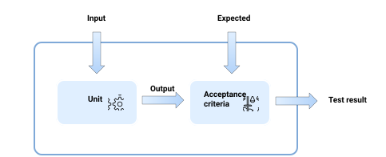

# Java Unit Testing

### What is a Unit :

A unit is a portion of code that does exactly one task, so it's the smallest testable part of an application.

In object-oriented programming, a unit can be a class or a function. In procedural programming, a unit is a function or a procedure.

## Unit Testing :



Generally, each unit behaves in a similar way: it consumes input data, performs some action on it and produces output data. We can use this behavior to verify the code. The test goes through the following stages:

1. We create two datasets: the input and the expected output;
2. We define acceptance criteria: some conditions determining if the unit works as expected. Usually, the acceptance criterion is a comparison of the actual output with the expected one.
3. We pass the created input dataset to the tested unit;
4. The input invokes code of the tested unit;
5. The code produces an output;
6. The produced output is checked by acceptance criteria which compare the actual output with the expected one;
7. Acceptance criteria return the result: pass or fail.

# JUnit for Java Unit Testing :

```java 

@Test
public void testMethod() {
    ...
}

```

One of the distinctive features of unit testing is the isolation of each test. To achieve that and avoid code duplication, you can use @Before, @BeforeClass, @After, and @AfterClass annotations.

```java
@BeforeClass
public static void setUpClass() throws Exception {
    // Code executed before the first test method
}
 
@Before
public void setUp() throws Exception {
    // Code executed before each test
}
 
@After
public void tearDown() throws Exception {
    // Code executed after each test 
}
 
@AfterClass
public static void tearDownClass() throws Exception {
    // Code executed after the last test method 
}
```

JUnit uses special API named Assertions as acceptance criteria. It is a set of methods that checks if the resulting value matches the expected value and throws an error if not. Some commonly used methods are:

1. assertEquals
2. assertTrue
3. assertNotNull

Example Of a JUnit test for a simple class :

```java 
//The class :
public class Calculator {
 
    public int add(int x, int y) {
        ...
    }
 
    public int subtract(int x, int y) {
        ...
    }
}

//----

//The test class In a different file :
import org.junit.Assert;
 
public class CalculatorTest {
    @Test
    public void testAdd() {
        Calculator calculator = new Calculator();
        int result = calculator.add(2, 2);
 
        Assert.assertEquals(4, result);
    }
 
    @Test
    public void testSubtract() {
        Calculator calculator = new Calculator();
        int result = calculator.subtract(4, 2);
 
        Assert.assertEquals(0, result);
    }
}

```

# Mockito :

Sometimes Unit test might be more difficult to maintain and even write then the class being tested. In this case Mockito provide a framework that allows us to create objects representing our class called as Mock.

Let's consider an example. UsdConverter class is responsible for converting local currency to USD (United States dollar). The test should check the behavior of the tested unit in isolation from its dependencies. As the exchange rate varies with time, UsdConverter uses ExchangeRateService to get the latest updates. Moreover, getUsd method of a live ExchangeRateService can send a request over HTTP to get the actual exchange rate, which is difficult to reproduce in the test environment. Mockito allows us to avoid those difficulties and provides an API for creating empty objects and managing behavior. 

```java
//UsdConverter.java
public class UsdConverter {
 
    private ExchangeRateService service;
 
    public UsdConverter(ExchangeRateService service) {
        this.service = service;
    }
 
    public BigDecimal convertToUsd(BigDecimal converted) {
        return converted.multiply(service.getUsd());
    }
}

//Using mockito, we create a mock of ExchangeRateService object and define its behavior in case of getUsd method invocation:

//UsdConverterTest.java
import org.junit.Assert;
import org.mockito.Mock;
 
public class UsdConverterTest {
 
    @Mock
    private ExchangeRateService service = Mockito.mock(ExchangeRateService.class);
 
    private UsdConverter converter = new UsdConverter(service);
 
    @Test
    public void testConvertToUsd() {
        Mockito.when(service.getUsd()).thenReturn(BigDecimal.valueOf(5));
 
        BigDecimal result = converter.convertToUsd(BigDecimal.valueOf(2));
        BigDecimal expected = BigDecimal.valueOf(10);
 
        Assert.assertEquals(expected, result);
    }
}
```

[Full List of features of the Mockito FrameWork for testing can be found here](https://site.mockito.org/)